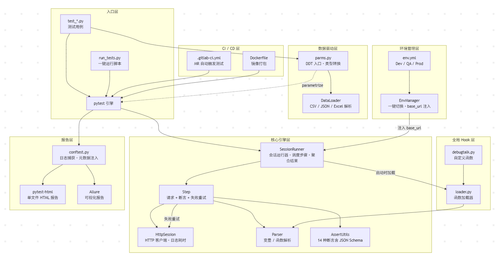

# 这是一个基于 HTTPRunner 架构的API自动化测试框架

- 作者：Smily
- 我参考了架构的设计并根据自己测试需求设计一个API测试框架，本设计做了大篇幅改动

## 项目架构图




## 核心功能一览

| 功能模块 | 说明 | 核心文件 |
|---------|------|---------|
| 核心引擎 | 请求发送、变量解析、断言校验、结果聚合 | `core/runner.py` `core/step.py` `core/client.py` `core/parser.py` |
| 数据驱动 | 读取 CSV/JSON/Excel 文件循环执行同一用例 | `utils/data_loader.py` `data/parms.py` |
| 全局 Hook | debugtalk.py 中自定义函数，用例中 `${func()}` 调用 | `debugtalk.py` `core/loader.py` |
| 断言升级 | 14 种断言：eq/ne/contains/type/regex/**json_schema** 等 | `utils/assert_utils.py` |
| 环境管理 | Dev/QA/Prod 一键切换，自动注入 base_url | `env.yml` `core/env_manager.py` |
| 失败重试 | Step 级重试（网络异常/断言失败）+ pytest 级重试 | `core/step.py` `pytest-rerunfailures` |
| 可视化报告 | pytest-html 单文件报告 + Allure + 失败日志捕获 | `conftest.py` `pytest.ini` |
| CI/CD | GitLab MR 自动触发、Docker 镜像打包 | `.gitlab-ci.yml` `Dockerfile` |

## 项目目录结构

```
API-Automated-Testing/
├── core/                           # 核心框架代码
│   ├── __init__.py
│   ├── client.py                   # HTTP 会话封装（基于 requests，自动记录日志与耗时）
│   ├── env_manager.py              # 环境管理器（Dev/QA/Prod 一键切换，加载 env.yml）
│   ├── loader.py                   # debugtalk.py 加载器（动态导入自定义函数）
│   ├── parser.py                   # 变量/函数解析器（解析 $var、${func()} 语法）
│   ├── runner.py                   # 测试会话运行器（调度步骤执行、聚合结果）
│   └── step.py                     # 测试步骤（请求+断言+失败重试编排）
│
├── data/                           # 数据文件目录
│   ├── __init__.py
│   ├── parms.py                    # DDT 入口（加载外部数据文件并参数化）
│   ├── test_users.csv              # 示例数据（CSV 格式）
│   ├── test_users.json             # 示例数据（JSON 格式）
│   ├── test_users.xlsx             # 示例数据（Excel 格式）
│   └── test_cases/
│       ├── __init__.py
│       └── demo_test.yml           # YAML 测试用例示例
│
├── logs/                           # 日志模块
│   ├── __init__.py
│   └── runner.py                   # 日志运行器
│
├── tests/                          # 测试用例目录
│   ├── __init__.py
│   └── test_demo.py                # 示例测试
│
├── utils/                          # 工具模块
│   ├── __init__.py
│   ├── assert_utils.py             # 断言工具（eq/contains/type/regex/json_schema 等 14 种）
│   ├── data_loader.py              # 数据加载器（解析 CSV/JSON/Excel 为参数化数据）
│   └── logger.py                   # 日志配置
│
├── .github/
│   └── workflows/
│       └── main.yml                # GitHub Actions CI 配置
│
├── .gitlab-ci.yml                  # GitLab CI/CD 配置（MR 触发自动测试）
├── .dockerignore                   # Docker 构建忽略文件
├── conftest.py                     # pytest 全局夹具（venv 检查、日志捕获、报告增强）
├── debugtalk.py                    # 全局 Hook（自定义函数：get_token/sign/gen_timestamp 等）
├── Dockerfile                      # Docker 镜像构建文件
├── env.yml                         # 环境配置（Dev/QA/Prod 的 base_url 与数据库连接）
├── main.py                         # 程序入口
├── pytest.ini                      # pytest 配置（报告生成、标记注册、警告过滤）
├── README .md                      # 项目说明文档
├── requirements.txt                # Python 依赖清单
├── run_tests.py                    # 一键运行脚本（支持 --env/--allure/--open）
├── test_assert.py                  # 断言能力测试
├── test_debugtalk.py               # 全局 Hook 测试
├── test_env.py                     # 环境管理测试
├── test_main.py                    # 主流程测试
├── test_params.py                  # 数据驱动测试
├── test_report.py                  # 报告生成测试
└── test_retry.py                   # 重试机制测试
```

## 环境准备

### 1. 安装依赖

```bash
pip install -r requirements.txt
```

### 2. 确认 Python 版本

本项目基于 Python 3.10 开发，推荐使用项目自带的虚拟环境：

```bash
# Windows
f:\XU\API-Automated-Testing\.venv\Scripts\python.exe -m pytest

# Linux / Mac
source .venv/bin/activate && pytest
```

## 如何运行框架

### 1.准备测试用例文件(data/test\_cases/demo\_test.yml)

```yaml
- config:
    name: "测试 HTTPBIN 接口"
    base_url: "https://httpbin.org"
    variables:
        user_id: 123

- test:
    name: "测试 GET 请求"
    request:
        url: "/get?id=$user_id"
        method: "GET"
    validate:
        - check: "status_code"
          assert_type: "eq"
          expect: 200
```

### 2.编写启动器(test\_main.py)

```python
import pytest
from core.runner import SessionRunner
from core.client import HttpSession
from httprunner.models import TConfig, TestCase

# 1. 模拟加载测试用例 (实际中可使用 loader 读取 YAML)
def get_testcase_data():
    return {
        "config": TConfig(name="测试用例", base_url="https://httpbin.org", variables={"user_id": 123}),
        "teststeps": [
            {
                "name": "测试 GET 请求",
                "request": {"url": "/get?id=$user_id", "method": "GET"},
                "validate": [{"check": "status_code", "assert_type": "eq", "expect": 200}]
            }
        ]
    }

# 2. Pytest 执行测试
def test_api_flow():
    # 初始化 Runner
    runner = SessionRunner()
    
    # 手动封装测试用例对象 (模拟 loader 的行为)
    testcase = get_testcase_data()
    
    # 开始执行
    runner.teststeps = testcase["teststeps"]
    runner.config = testcase["config"]
    runner.test_start()
    
    # 验证最终结果
    assert runner.get_summary().success is True
    print("测试运行完成，全部通过！")
```

### 3.如何执行？

终端输入

```bash
pytest test_main.py
```

或使用一键运行脚本（自动生成报告）：

```bash
python run_tests.py                    # 默认运行
python run_tests.py --env qa           # 切换 QA 环境
python run_tests.py --allure --open    # 生成 Allure 报告并打开
```

### 4.数据驱动测试的使用方法：

- 将数据从外部文件（如 CSV、JSON）加载到测试用例中
- 使用 pytest.mark.parametrize 装饰器将数据绑定到测试用例参数

```Python
from data.parms import load_params

# 加载数据（自动识别格式）
data = load_params("test_users.csv", converters={"user_id": int})

# 配合 pytest 参数化
@pytest.mark.parametrize("params", data)
def test_xxx(params):
    runner = SessionRunner()
    runner.session_variables = {"user_id": params["user_id"]}
    
```

- 执行测试时，每个参数值都会触发测试用例一次

### 5.在debugtalk.py中调用函数后，在用例中通过${func()}调用

```python
# debugtalk.py
def get_token():
    return f"token_{uuid.uuid4().hex}"

# 用例中（YAML 或 dict）
runner.config = TConfig(name="用例", base_url="https://api.com", variables={})
step = Step(
    name="带签名的请求",
    request={
        "url": "/api?token=${get_token()}&ts=${gen_timestamp()}",
        "method": "GET"
    },
)
```

### 6. JSON Schema 断言使用示例

```python
step = Step(
    name="接口合规性校验",
    request={"url": "/user", "method": "GET"},
    validate=[
        {"check": "status_code", "assert_type": "eq", "expect": 200},
        {"check": "body", "assert_type": "json_schema", "expect": {
            "type": "object",
            "required": ["id", "name"],
            "properties": {
                "id": {"type": "integer"},
                "name": {"type": "string"},
                "email": {"type": "string", "format": "email"},
            },
        }},
    ],
)
```

### 7. 失败重试机制

**Step 级重试**，针对单个接口：

```python
step = Step(
    name="偶发不稳定接口",
    request={"url": "/flaky", "method": "GET"},
    validate=[{"check": "status_code", "assert_type": "eq", "expect": 200}],
    retry_times=3,       # 失败后重试 3 次
    retry_interval=2,    # 每次重试前等待 2 秒
)
```

**pytest 级重试**，针对整个用例：

```python
@pytest.mark.flaky(reruns=2, reruns_delay=1)
def test_unstable_api():
    ...
```

### 8. 环境管理（Dev/QA/Prod 一键切换）

```bash
# 通过环境变量切换（CI/CD 友好）
# Windows PowerShell
$env:TEST_ENV="qa"; pytest

# Linux / Mac
TEST_ENV=prod pytest
```

```python
# 代码中运行时切换
from core.env_manager import get_env_manager
get_env_manager().switch_env("prod")

# 读取数据库配置
db = get_env_manager().db_config
```

### 9. CI/CD 自动触发

**GitLab MR 流程**：提交 Merge Request 后自动触发 `syntax-check` + `run-tests`，在 MR 界面直接查看测试结果与报告下载。

**Docker 运行**：

```bash
docker build -t api-auto-test .
docker run --rm -e TEST_ENV=qa api-auto-test
docker run --rm -v $(pwd)/reports:/app/reports api-auto-test  # 报告挂载到宿主机
```
